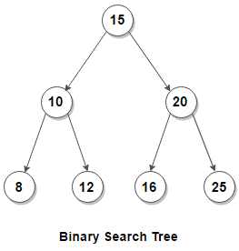

# Binary Search Tree

2021-06-14, 2021-06-22

### About

A [binary search tree (BST)](https://en.wikipedia.org/wiki/Binary_search_tree) in this exercise is:

- An ordered (sorted) binary tree.
- A node has left and/or right children nodes or no child node (*leaf* node).
- Left child < Node < Right child

```
struct Node
{
    int data;
    Node *left, *right;
};
```

When a node does not have `*left` and `*right` children (e.g., `None` or `NULL`), it is called a *leaf*.

### Problem description



1. Represent the above tree in a code.
2. Write a routine to print the tree.
3. Write a routine to insert a Node into the specified Node.
4. Write a routine to delete a Node.

In this exercise, pick a traversal method of your choice. There are:

- depth-first search (DFS)
    - Pre-order: Print the node upon first visit. A serialized values retains the structure of the tree. e.g., `15 10 8 12 20 16 25`
    - Inorder: Print the node upon second visit. Values are sorderd. e.g., `8 10 12 15 16 20 25` (note: it becomes descenging by visiting the right node first instead of left)
    - postorder: Print the node upon the last (third) visit. Order to delete the tree from the leafs first. e.g., `8 12 10 16 25 20 15`
- breadth-first search (BFS)

### References

- [Top Algorithms/Data Structures/Concepts every computer science student should know](https://medium.com/techie-delight/top-algorithms-data-structures-concepts-every-computer-science-student-should-know-e0549c67b4ac), Techie Delight, 2018.
- [Tree Traversals (Inorder, Preorder and Postorder)](https://www.geeksforgeeks.org/tree-traversals-inorder-preorder-and-postorder/), GeeksForGeeks, 2021.
- [Tree travaesal](https://en.wikipedia.org/wiki/Tree_traversal), Wikipedia,
- [Simplest Binary Tree Traversal trick for preorder inorder postorder](https://www.youtube.com/watch?v=WLvU5EQVZqY), YouTube, 2019 (7'14")
- 