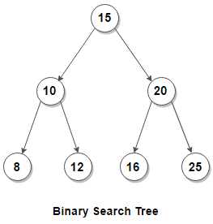
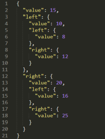

# Binary Search Tree

2021-06-14, 2021-06-22, 2021-06-29

### About

A [binary search tree (BST)](https://en.wikipedia.org/wiki/Binary_search_tree) in this exercise is:

- An ordered (sorted) binary tree.
- A node has left and/or right children nodes or no child node (*leaf* node).
- Left child < Node < Right child

```
struct Node
{
    int data;
    Node *left, *right;                                       // NULL for no-child
};
```

When a node does not have `*left` and `*right` children (e.g., `None` or `NULL`), it is called a *leaf*.

### Problem description

 

1. Represent the above tree in a code.
2. Write a routine to traverse the tree. There are a various methods as below. Implement any/all of them.
    - *Depth-first search* (DFS): Go deeper first.
        - *Pre-order*: Print the node upon first visit. A list of the serialized values retains the structure of the tree. e.g., `15 10 8 12 20 16 25`
        - *In-order*: Print the node upon second visit. A list is sorted when the left nodes are visited firrst . e.g., `8 10 12 15 16 20 25`. When the right nodes are visisted first, the list becomes descenging.
        - *Post-order*: Print the node upon the last (third) visit. Order to delete the tree from the leafs first. e.g., `8 12 10 16 25 20 15` (to delete 10, you need to delete 8, 12 then 10).
    - *Breadth-first search* (BFS): Print the nodes from left to right, top to bottom. e.g., `15 10 20 8 12 16 25`
3. Write a routine to insert a Node.
    - Traverse the tree
        - If the new node's value < node value, traverse to the Left.
            - If there is no left child, add the new node to the left.
            - Otherwise recursively traverse
        - If the new node's value > node value, traverse to the Right.
            - If there is no right child, add the new node to the right.
            - Otherwise recursively traverse
        - If the new node's value == node value, exit (assuming the nodes are unique).
4. Write a routine to delete a Node.
    - When the target node does not have child: Remove the node.
    - When the target node has only one child: Replace the node with the child.
    - When the targer node has both children: Replace the node with the next node that follows in in-order search (the next larger node)


### References

- [Top Algorithms/Data Structures/Concepts every computer science student should know](https://medium.com/techie-delight/top-algorithms-data-structures-concepts-every-computer-science-student-should-know-e0549c67b4ac), Techie Delight, 2018.
- [Tree Traversals (Inorder, Preorder and Postorder)](https://www.geeksforgeeks.org/tree-traversals-inorder-preorder-and-postorder/), GeeksForGeeks, 2021.
- [Tree traversal](https://en.wikipedia.org/wiki/Tree_traversal), Wikipedia.
- [Breadth-first traversal](https://en.wikipedia.org/wiki/Breadth-first_search), Wikipedia.
- [Simplest Binary Tree Traversal trick for preorder inorder postorder](https://www.youtube.com/watch?v=WLvU5EQVZqY), YouTube, 2019 (7'14")